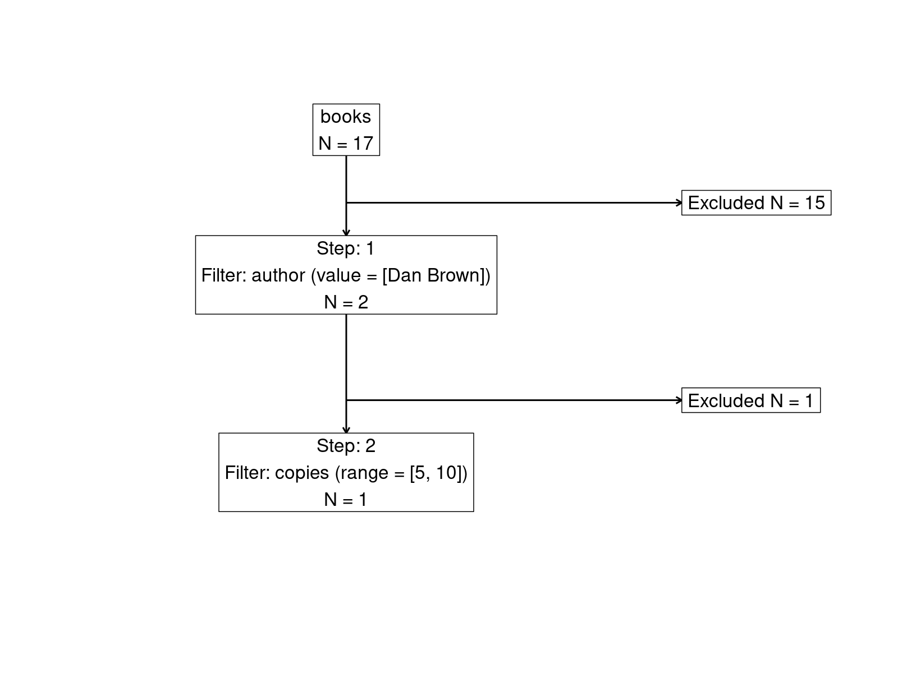

# cohortBuilder 

[](https://r-world-devs.github.io/cohortBuilder/)
[](https://lifecycle.r-lib.org/articles/stages.html#experimental)

## Overview

`cohortBuilder` provides common API for creating cohorts on multiple
data sources, such as local data frame, database schema or external data
api.

With only two steps:

1.  Configuring data source with `set_source`.
2.  Initializing cohort with `cohort`.

You can operate on data using common methods, such as:

- `filter` - to define and `run` to apply filtering rules,
- `step` - to perform multi-stage filtering,
- `get_data`, `stat`, `attrition`, `plot_data` - to extract, sum up or
  visualize your cohort data.

With `cohortBuilder` you can share the cohort easier with useful
methods:

- `code` - to get reproducible cohort creation code,
- `get_state` - to get cohort state (e.g. in JSON) that can be then
  easily restored with `restore`.

Or modify the cohort configuration with:

- `add_filter`, `rm_filter`, `update_filter` - to manage filters
  definition
- `add_step`, `rm_step` - to manage filtering steps,
- `update_source` - to manage the cohort source.

## Data sources and extensions

The goal of `cohortBuilder` is to provide common API for creating data
cohorts, but also to be easily extendable for working on different data
sources (and interactive dashboards).

`cohortBuilder` allows to operate on local data frames (or list of data
frames), yet you may easily switch to a database source by loading
`cohortBuilder.db` layer.

As a standalone R package, you use `cohortBuilder` to perform all the
operations in non-interactive R script, but its shiny layer
`shinyCohortBuilder` package helps you to easily switch to intuitive gui
mode. More to that you may integrate `cohortBuilder` with your custom
Shiny application.

If you want to learn how to write custom source extension, please check
`vignette("custom-extensions")`.

## Installation

``` r
# CRAN version
install.packages("cohortBuilder")

# Latest development version
remotes::install_github("https://github.com/r-world-devs/cohortBuilder")
```

## Usage

``` r
librarian_source <- set_source(
  as.tblist(librarian)
)

coh <- librarian_source %>% 
  cohort(
    filter(
      "discrete", id = "author", dataset = "books", 
      variable = "author", value = "Dan Brown"
    ),
    filter(
      "range", id = "copies", dataset = "books", 
      variable = "copies", range = c(5, 10)
    ),
    filter(
      "date_range", id = "registered", dataset = "borrowers", 
      variable = "registered", range = c(as.Date("2010-01-01"), Inf)
    ) 
  ) %>% 
  run()

get_data(coh)
#> $books
#> # A tibble: 1 × 6
#>   isbn          title             genre                       publisher 
#>   <chr>         <chr>             <chr>                       <chr>     
#> 1 0-385-50420-9 The Da Vinci Code Crime, Thriller & Adventure Transworld
#>   author    copies
#>   <chr>      <int>
#> 1 Dan Brown      7
#> 
#> $borrowers
#> # A tibble: 8 × 6
#>   id     registered address                                         
#>   <chr>  <date>     <chr>                                           
#> 1 000013 2011-09-30 534 Iroquois Ave. Watertown, MA 02472           
#> 2 000014 2013-01-12 7968 Victoria Drive Dearborn, MI 48124          
#> 3 000015 2013-12-24 9484 Somerset Road Romeoville, IL 60446         
#> 4 000016 2014-01-20 48 Prairie Ave. Palos Verdes Peninsula, CA 90274
#> 5 000017 2014-04-07 8501 Lawrence Rd. Terre Haute, IN 47802         
#>   name                    phone_number program 
#>   <chr>                   <chr>        <chr>   
#> 1 Dr. Sharif Kunde        104-832-8013 premium 
#> 2 Marlena Reichert PhD    044-876-8419 vip     
#> 3 Mr. Brandan Oberbrunner 568-044-7463 vip     
#> 4 Lloyd Adams III         001-017-0211 standard
#> 5 Randy Ziemann           895-995-2326 premium 
#> # ℹ 3 more rows
#> 
#> $issues
#> # A tibble: 50 × 4
#>   id     borrower_id isbn              date      
#>   <chr>  <chr>       <chr>             <date>    
#> 1 000001 000019      0-676-97976-9     2015-03-17
#> 2 000002 000010      978-0-7528-6053-4 2008-09-13
#> 3 000003 000016      0-09-177373-3     2014-09-28
#> 4 000004 000005      0-224-06252-2     2005-11-14
#> 5 000005 000004      0-340-89696-5     2006-03-19
#> # ℹ 45 more rows
#> 
#> $returns
#> # A tibble: 30 × 2
#>   id     date      
#>   <chr>  <date>    
#> 1 000001 2015-04-06
#> 2 000003 2014-10-23
#> 3 000004 2005-12-29
#> 4 000005 2006-03-26
#> 5 000006 2016-08-30
#> # ℹ 25 more rows
#> 
#> attr(,"class")
#> [1] "tblist"
#> attr(,"call")
#> as.tblist(librarian)
```

``` r
coh <- librarian_source %>% 
  cohort() %->% 
  step(
    filter(
      "discrete", id = "author", dataset = "books", 
      variable = "author", value = "Dan Brown"
    ),
    filter(
      "date_range", id = "registered", dataset = "borrowers", 
      variable = "registered", range = c(as.Date("2010-01-01"), Inf)
    )
  ) %->% 
  step(
    filter(
      "range", id = "copies", dataset = "books", 
      variable = "copies", range = c(5, 10)
    )
  ) %>% 
  run()
```

``` r
get_data(coh, step_id = 1)
#> $books
#> # A tibble: 2 × 6
#>   isbn          title             genre                       publisher 
#>   <chr>         <chr>             <chr>                       <chr>     
#> 1 0-385-50420-9 The Da Vinci Code Crime, Thriller & Adventure Transworld
#> 2 0-671-02735-2 Angels and Demons Crime, Thriller & Adventure Transworld
#>   author    copies
#>   <chr>      <int>
#> 1 Dan Brown      7
#> 2 Dan Brown      4
#> 
#> $borrowers
#> # A tibble: 8 × 6
#>   id     registered address                                         
#>   <chr>  <date>     <chr>                                           
#> 1 000013 2011-09-30 534 Iroquois Ave. Watertown, MA 02472           
#> 2 000014 2013-01-12 7968 Victoria Drive Dearborn, MI 48124          
#> 3 000015 2013-12-24 9484 Somerset Road Romeoville, IL 60446         
#> 4 000016 2014-01-20 48 Prairie Ave. Palos Verdes Peninsula, CA 90274
#> 5 000017 2014-04-07 8501 Lawrence Rd. Terre Haute, IN 47802         
#>   name                    phone_number program 
#>   <chr>                   <chr>        <chr>   
#> 1 Dr. Sharif Kunde        104-832-8013 premium 
#> 2 Marlena Reichert PhD    044-876-8419 vip     
#> 3 Mr. Brandan Oberbrunner 568-044-7463 vip     
#> 4 Lloyd Adams III         001-017-0211 standard
#> 5 Randy Ziemann           895-995-2326 premium 
#> # ℹ 3 more rows
#> 
#> $issues
#> # A tibble: 50 × 4
#>   id     borrower_id isbn              date      
#>   <chr>  <chr>       <chr>             <date>    
#> 1 000001 000019      0-676-97976-9     2015-03-17
#> 2 000002 000010      978-0-7528-6053-4 2008-09-13
#> 3 000003 000016      0-09-177373-3     2014-09-28
#> 4 000004 000005      0-224-06252-2     2005-11-14
#> 5 000005 000004      0-340-89696-5     2006-03-19
#> # ℹ 45 more rows
#> 
#> $returns
#> # A tibble: 30 × 2
#>   id     date      
#>   <chr>  <date>    
#> 1 000001 2015-04-06
#> 2 000003 2014-10-23
#> 3 000004 2005-12-29
#> 4 000005 2006-03-26
#> 5 000006 2016-08-30
#> # ℹ 25 more rows
#> 
#> attr(,"class")
#> [1] "tblist"
#> attr(,"call")
#> as.tblist(librarian)
```

``` r
get_data(coh, step_id = 2)
#> $books
#> # A tibble: 1 × 6
#>   isbn          title             genre                       publisher 
#>   <chr>         <chr>             <chr>                       <chr>     
#> 1 0-385-50420-9 The Da Vinci Code Crime, Thriller & Adventure Transworld
#>   author    copies
#>   <chr>      <int>
#> 1 Dan Brown      7
#> 
#> $borrowers
#> # A tibble: 8 × 6
#>   id     registered address                                         
#>   <chr>  <date>     <chr>                                           
#> 1 000013 2011-09-30 534 Iroquois Ave. Watertown, MA 02472           
#> 2 000014 2013-01-12 7968 Victoria Drive Dearborn, MI 48124          
#> 3 000015 2013-12-24 9484 Somerset Road Romeoville, IL 60446         
#> 4 000016 2014-01-20 48 Prairie Ave. Palos Verdes Peninsula, CA 90274
#> 5 000017 2014-04-07 8501 Lawrence Rd. Terre Haute, IN 47802         
#>   name                    phone_number program 
#>   <chr>                   <chr>        <chr>   
#> 1 Dr. Sharif Kunde        104-832-8013 premium 
#> 2 Marlena Reichert PhD    044-876-8419 vip     
#> 3 Mr. Brandan Oberbrunner 568-044-7463 vip     
#> 4 Lloyd Adams III         001-017-0211 standard
#> 5 Randy Ziemann           895-995-2326 premium 
#> # ℹ 3 more rows
#> 
#> $issues
#> # A tibble: 50 × 4
#>   id     borrower_id isbn              date      
#>   <chr>  <chr>       <chr>             <date>    
#> 1 000001 000019      0-676-97976-9     2015-03-17
#> 2 000002 000010      978-0-7528-6053-4 2008-09-13
#> 3 000003 000016      0-09-177373-3     2014-09-28
#> 4 000004 000005      0-224-06252-2     2005-11-14
#> 5 000005 000004      0-340-89696-5     2006-03-19
#> # ℹ 45 more rows
#> 
#> $returns
#> # A tibble: 30 × 2
#>   id     date      
#>   <chr>  <date>    
#> 1 000001 2015-04-06
#> 2 000003 2014-10-23
#> 3 000004 2005-12-29
#> 4 000005 2006-03-26
#> 5 000006 2016-08-30
#> # ℹ 25 more rows
#> 
#> attr(,"class")
#> [1] "tblist"
#> attr(,"call")
#> as.tblist(librarian)
```

``` r
update_filter(
  coh, step_id = 1, filter_id = "author",
  range = c(5, 6)
)
run(coh)

get_data(coh, step_id = 2)
#> $books
#> # A tibble: 1 × 6
#>   isbn          title             genre                       publisher 
#>   <chr>         <chr>             <chr>                       <chr>     
#> 1 0-385-50420-9 The Da Vinci Code Crime, Thriller & Adventure Transworld
#>   author    copies
#>   <chr>      <int>
#> 1 Dan Brown      7
#> 
#> $borrowers
#> # A tibble: 8 × 6
#>   id     registered address                                         
#>   <chr>  <date>     <chr>                                           
#> 1 000013 2011-09-30 534 Iroquois Ave. Watertown, MA 02472           
#> 2 000014 2013-01-12 7968 Victoria Drive Dearborn, MI 48124          
#> 3 000015 2013-12-24 9484 Somerset Road Romeoville, IL 60446         
#> 4 000016 2014-01-20 48 Prairie Ave. Palos Verdes Peninsula, CA 90274
#> 5 000017 2014-04-07 8501 Lawrence Rd. Terre Haute, IN 47802         
#>   name                    phone_number program 
#>   <chr>                   <chr>        <chr>   
#> 1 Dr. Sharif Kunde        104-832-8013 premium 
#> 2 Marlena Reichert PhD    044-876-8419 vip     
#> 3 Mr. Brandan Oberbrunner 568-044-7463 vip     
#> 4 Lloyd Adams III         001-017-0211 standard
#> 5 Randy Ziemann           895-995-2326 premium 
#> # ℹ 3 more rows
#> 
#> $issues
#> # A tibble: 50 × 4
#>   id     borrower_id isbn              date      
#>   <chr>  <chr>       <chr>             <date>    
#> 1 000001 000019      0-676-97976-9     2015-03-17
#> 2 000002 000010      978-0-7528-6053-4 2008-09-13
#> 3 000003 000016      0-09-177373-3     2014-09-28
#> 4 000004 000005      0-224-06252-2     2005-11-14
#> 5 000005 000004      0-340-89696-5     2006-03-19
#> # ℹ 45 more rows
#> 
#> $returns
#> # A tibble: 30 × 2
#>   id     date      
#>   <chr>  <date>    
#> 1 000001 2015-04-06
#> 2 000003 2014-10-23
#> 3 000004 2005-12-29
#> 4 000005 2006-03-26
#> 5 000006 2016-08-30
#> # ℹ 25 more rows
#> 
#> attr(,"class")
#> [1] "tblist"
#> attr(,"call")
#> as.tblist(librarian)
```

``` r
code(coh)
#> .pre_filtering <- function(source, data_object, step_id) {
#>     for (dataset in names(data_object)) {
#>         attr(data_object[[dataset]], "filtered") <- FALSE
#>     }
#>     return(data_object)
#> }
#> .run_binding <- function(source, binding_key, data_object_pre, data_object_post,
#>     ...) {
#>     binding_dataset <- binding_key$update$dataset
#>     dependent_datasets <- names(binding_key$data_keys)
#>     active_datasets <- data_object_post %>%
#>         purrr::keep(~attr(., "filtered")) %>%
#>         names()
#>     if (!any(dependent_datasets %in% active_datasets)) {
#>         return(data_object_post)
#>     }
#>     key_values <- NULL
#>     common_key_names <- paste0("key_", seq_along(binding_key$data_keys[[1]]$key))
#>     for (dependent_dataset in dependent_datasets) {
#>         key_names <- binding_key$data_keys[[dependent_dataset]]$key
#>         tmp_key_values <- dplyr::distinct(data_object_post[[dependent_dataset]][,
#>             key_names, drop = FALSE]) %>%
#>             stats::setNames(common_key_names)
#>         if (is.null(key_values)) {
#>             key_values <- tmp_key_values
#>         } else {
#>             key_values <- dplyr::inner_join(key_values, tmp_key_values, by = common_key_names)
#>         }
#>     }
#>     data_object_post[[binding_dataset]] <- dplyr::inner_join(switch(as.character(binding_key$post),
#>         `FALSE` = data_object_pre[[binding_dataset]], `TRUE` = data_object_post[[binding_dataset]]),
#>         key_values, by = stats::setNames(common_key_names, binding_key$update$key))
#>     if (binding_key$activate) {
#>         attr(data_object_post[[binding_dataset]], "filtered") <- TRUE
#>     }
#>     return(data_object_post)
#> }
#> source <- list(dtconn = as.tblist(librarian))
#> data_object <- source$dtconn
#> step_id <- "1"
#> pre_data_object <- data_object
#> data_object <- .pre_filtering(source, data_object, "1")
#> data_object[["books"]] <- data_object[["books"]] %>%
#>     dplyr::filter(author %in% c("Dan Brown", NA))
#> attr(data_object[["books"]], "filtered") <- TRUE
#> data_object[["borrowers"]] <- data_object[["borrowers"]] %>%
#>     dplyr::filter((registered <= Inf & registered >= 14610) | is.na(registered))
#> attr(data_object[["borrowers"]], "filtered") <- TRUE
#> data_object <- .post_filtering(source, data_object, "1")
#> for (binding_key in binding_keys) {
#>     data_object <- .run_binding(source, binding_key, pre_data_object, data_object)
#> }
#> step_id <- "2"
#> data_object <- .pre_filtering(source, data_object, "2")
#> data_object[["books"]] <- data_object[["books"]] %>%
#>     dplyr::filter((copies <= 10 & copies >= 5) | is.na(copies))
#> attr(data_object[["books"]], "filtered") <- TRUE
#> data_object <- .post_filtering(source, data_object, "2")
```

``` r
attrition(coh, dataset = "books")
```



``` r
get_state(coh, json = TRUE)
#> [{"step":"1","filters":[{"range":[5,6],"type":"discrete","id":"author","name":"author","variable":"author","value":"Dan Brown","dataset":"books","keep_na":true,"description":null,"active":true},{"type":"date_range","id":"registered","name":"registered","variable":"registered","range":["2010-01-01","Inf"],"dataset":"borrowers","keep_na":true,"description":null,"active":true}]},{"step":"2","filters":[{"type":"range","id":"copies","name":"copies","variable":"copies","range":[5,10],"dataset":"books","keep_na":true,"description":null,"active":true}]}]
```

## Acknowledgement

Special thanks to:

- [Kamil Wais](mailto:kamil.wais@gmail.com) for highlighting the need
  for the package and its relevance to real-world applications.
- [Adam Foryś](mailto:adam.forys@gmail.com) for technical support,
  numerous suggestions for the current and future implementation of the
  package.
- [Paweł Kawski](mailto:pawel.kawski@gmail.com) for indication of
  initial assumptions about the package based on real-world medical
  data.

## Getting help

In a case you found any bugs, have feature request or general question
please file an issue at the package
[Github](https://github.com/r-world-devs/cohortBuilder/issues). You may
also contact the package author directly via email at
<krystian8207@gmail.com>.
