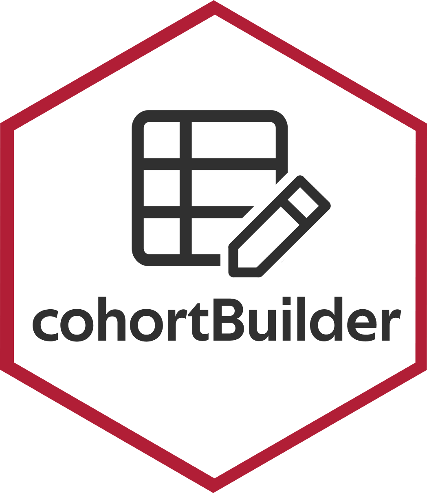

# cohortBuilder 

[](https://r-world-devs.github.io/cohortBuilder/)
[](https://lifecycle.r-lib.org/articles/stages.html#experimental)

<!-- badges: start -->

[](https://github.com/r-world-devs/cohortBuilder/actions/workflows/R-CMD-check.yaml)
[](https://app.codecov.io/gh/r-world-devs/cohortBuilder)
<!-- badges: end -->

## Overview

`cohortBuilder` provides common API for creating cohorts on multiple
data sources, such as local data frame, database schema or external data
api.

With only two steps:

1.  Configuring data source with `set_source`.
2.  Initializing cohort with `cohort`.

You can operate on data using common methods, such as:

- `filter` - to define and `run` to apply filtering rules,
- `step` - to perform multi-stage filtering,
- `get_data`, `stat`, `attrition`, `plot_data` - to extract, sum up or
  visualize your cohort data.

With `cohortBuilder` you can share the cohort easier with useful
methods:

- `code` - to get reproducible cohort creation code,
- `get_state` - to get cohort state (e.g. in JSON) that can be then
  easily restored with `restore`.

Or modify the cohort configuration with:

- `add_filter`, `rm_filter`, `update_filter` - to manage filters
  definition
- `add_step`, `rm_step` - to manage filtering steps,
- `update_source` - to manage the cohort source.

## Data sources and extensions

The goal of `cohortBuilder` is to provide common API for creating data
cohorts, but also to be easily extendable for working on different data
sources (and interactive dashboards).

`cohortBuilder` allows to operate on local data frames (or list of data
frames), yet you may easily switch to a database source by loading
`cohortBuilder.db` layer.

As a standalone R package, you use `cohortBuilder` to perform all the
operations in non-interactive R script, but its shiny layer
`shinyCohortBuilder` package helps you to easily switch to intuitive gui
mode. More to that you may integrate `cohortBuilder` with your custom
Shiny application.

If you want to learn how to write custom source extension, please check
`vignette("custom-extensions")`.

## Installation

``` r
# CRAN version
install.packages("cohortBuilder")

# Latest development version
remotes::install_github("https://github.com/r-world-devs/cohortBuilder")
```

## Acknowledgement

Special thanks to:

- [Kamil Wais](mailto:kamil.wais@gmail.com) for highlighting the need
  for the package and its relevance to real-world applications.
- [Adam Foryś](mailto:adam.forys@gmail.com) for technical support,
  numerous suggestions for the current and future implementation of the
  package.
- [Paweł Kawski](mailto:pawel.kawski@gmail.com) for indication of
  initial assumptions about the package based on real-world medical
  data.

## Getting help

In a case you found any bugs, have feature request or general question
please file an issue at the package
[Github](https://github.com/r-world-devs/cohortBuilder/issues). You may
also contact the package author directly via email at
<krystian8207@gmail.com>.
