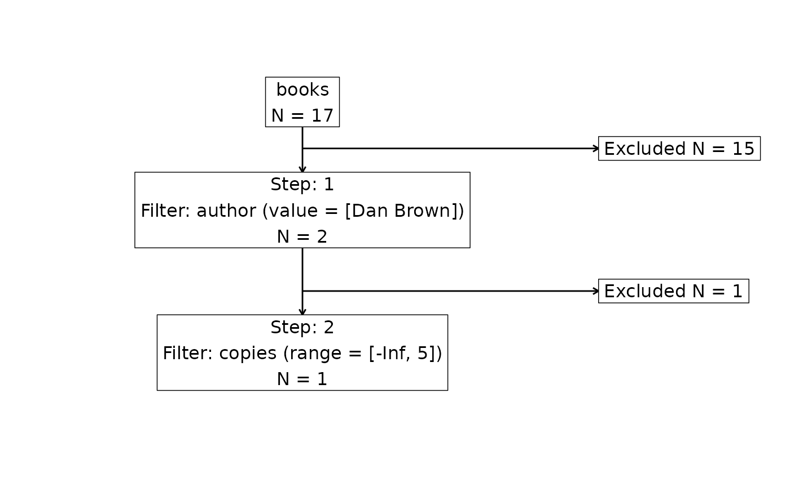
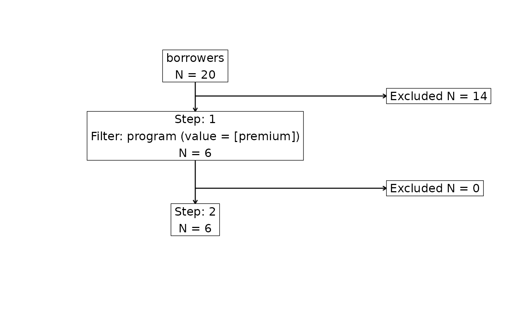

# Introduction to cohortBuilder

This document presents to you basic functionality offered by
`cohortBuilder` package. You’ll learn here about Source and Cohort
objects, how to configure them with filters and filtering steps. Later
on, we’ll present most common Cohort methods that allow to manipulate
the object and extract useful information about Cohort data and state.

## cohortBuilder vs. dplyr

If you’re familiar with `dplyr` (or any other data manipulation package)
you may be wondering what `cohortBuilder` has been created for.

Our main goal for creating `cohortBuilder` was to provide a common
syntax for operating (filtering) on any data source you need. This
follows the idea for having `dplyr` and its database counterpart
`dbplyr` package.

In order to achieve the goal, we put an emphasis on possibility to write
custom extensions in terms of data source type, or operating backend
(underneath `cohortBuilder` uses `dplyr` to operate on data frames, but
you may create an extension using e.g. `data.table`). See
[`vignette("custom-extensions")`](https://r-world-devs.github.io/cohortBuilder/articles/custom-extensions.md).

The second goal was integration of `cohortBuilder` with `shiny`. The GUI
for `cohortBuilder` is provided by `shinyCohortBuilder` package. With
this extension you may easily open Cohort configuration panel locally,
or include it in you custom dashboard.

## Data: librarian

To present `cohortBuilder`’s functionality we’ll be operating on
`librarian` dataset. `librarian` is a list of four tables, storing a
sample of book library management database.

``` r
cohortBuilder::librarian
#> $books
#> # A tibble: 17 × 6
#>   isbn              title                          genre publisher author copies
#>   <chr>             <chr>                          <chr> <chr>     <chr>   <int>
#> 1 0-385-50420-9     The Da Vinci Code              Crim… Transwor… Dan B…      7
#> 2 0-7679-0817-1     A Short History of Nearly Eve… Popu… Transwor… Bill …      4
#> 3 978-0-15-602943-8 The Time Traveler's Wife       Gene… Random H… Audre…      2
#> 4 0-224-06252-2     Atonement                      Gene… Random H… Ian M…      8
#> 5 0-676-97376-0     Life of Pi                     Gene… Canongate Yann …     11
#> # ℹ 12 more rows
#> 
#> $borrowers
#> # A tibble: 20 × 6
#>   id     registered address                           name  phone_number program
#>   <chr>  <date>     <chr>                             <chr> <chr>        <chr>  
#> 1 000001 2001-06-09 66 N. Evergreen Ave. Norristown,… Mrs.… 626-594-4729 premium
#> 2 000002 2002-08-10 8196 Windsor Road Muscatine, IA … Ms. … 919-530-5272 standa…
#> 3 000003 2003-02-15 6 Wood Lane Calumet City, IL 604… Inga… 706-669-5694 NA     
#> 4 000004 2004-06-14 18 Nut Swamp Road Merrimack, NH … Keys… 746-328-6598 standa…
#> 5 000005 2005-01-15 580 Chapel Rd. Delray Beach, FL … Ferd… 127-363-0738 premium
#> # ℹ 15 more rows
#> 
#> $issues
#> # A tibble: 50 × 4
#>   id     borrower_id isbn              date      
#>   <chr>  <chr>       <chr>             <date>    
#> 1 000001 000019      0-676-97976-9     2015-03-17
#> 2 000002 000010      978-0-7528-6053-4 2008-09-13
#> 3 000003 000016      0-09-177373-3     2014-09-28
#> 4 000004 000005      0-224-06252-2     2005-11-14
#> 5 000005 000004      0-340-89696-5     2006-03-19
#> # ℹ 45 more rows
#> 
#> $returns
#> # A tibble: 30 × 2
#>   id     date      
#>   <chr>  <date>    
#> 1 000001 2015-04-06
#> 2 000003 2014-10-23
#> 3 000004 2005-12-29
#> 4 000005 2006-03-26
#> 5 000006 2016-08-30
#> # ℹ 25 more rows
```

To learn more check
[`?librarian`](https://r-world-devs.github.io/cohortBuilder/reference/librarian.md).

## Source object

Every time you work with `cohortBuilder` the crucial part is to properly
define the data source with `set_source` function. Source is an R6
object storing metadata about data and its origin. The metadata allows
`cohortBuilder` to distinct what methods to use when performing
operations on it.

To define a new source you need to provide data (connection).

Let’s create now a new source storing `librarian` data. To do so, we
pass one obligatory parameter `dtconn` to `set_source` method.

`dtconn` stores data connection responsible for informing
`cohortBuilder` on what data are we gonna work (and what extension to
use, if any).

If you want to operate on R-loaded list of tables, provide `tblist`
class object. `tblist` is just a named list of data frames having
`tblist` class.

**Note.** In order to create ‘tblist’ object use `tblist`,
e.g. `tblist(mtcars, iris)`. **Note.** In order to convert list of data
frames to ‘tblist’ just use `as.tblist`.

``` r
str(as.tblist(librarian), max.level = 1L)
#> List of 4
#>  $ books    : tibble [17 × 6] (S3: tbl_df/tbl/data.frame)
#>  $ borrowers: tibble [20 × 6] (S3: tbl_df/tbl/data.frame)
#>  $ issues   : tibble [50 × 4] (S3: tbl_df/tbl/data.frame)
#>  $ returns  : tibble [30 × 2] (S3: tbl_df/tbl/data.frame)
#>  - attr(*, "class")= chr "tblist"
```

Let’s proceed with creating the source:

``` r
librarian_source <- set_source(
  as.tblist(librarian)
)
class(librarian_source)
#> [1] "tblist" "Source" "R6"
```

To learn more about `set_source`’s arguments check
[`?set_source`](https://r-world-devs.github.io/cohortBuilder/reference/set_source.md).

## Cohort object

When `Source` object is ready, the next step is to create a `Cohort`
object. `Cohort` is again an R6 object, providing methods for operating
on data included in `Source`.

`Cohort` is responsible in particular for:

- storing definitions of filters (and filtering steps),
- running filtering and keeping result of it,
- computing and caching filter and data statistics,
- keeping and updating filtering configuration state.

In the standard workflow we build `Cohort` on top of `Source`. We
achieve it with `cohort` function:

``` r
librarian_cohort <- librarian_source %>%
  cohort()
class(librarian_cohort)
#> [1] "Cohort" "R6"
```

With the existing `Cohort` we may get underlying data with `get_data`:

``` r
get_data(librarian_cohort)
#> $books
#> # A tibble: 17 × 6
#>   isbn              title                          genre publisher author copies
#>   <chr>             <chr>                          <chr> <chr>     <chr>   <int>
#> 1 0-385-50420-9     The Da Vinci Code              Crim… Transwor… Dan B…      7
#> 2 0-7679-0817-1     A Short History of Nearly Eve… Popu… Transwor… Bill …      4
#> 3 978-0-15-602943-8 The Time Traveler's Wife       Gene… Random H… Audre…      2
#> 4 0-224-06252-2     Atonement                      Gene… Random H… Ian M…      8
#> 5 0-676-97376-0     Life of Pi                     Gene… Canongate Yann …     11
#> # ℹ 12 more rows
#> 
#> $borrowers
#> # A tibble: 20 × 6
#>   id     registered address                           name  phone_number program
#>   <chr>  <date>     <chr>                             <chr> <chr>        <chr>  
#> 1 000001 2001-06-09 66 N. Evergreen Ave. Norristown,… Mrs.… 626-594-4729 premium
#> 2 000002 2002-08-10 8196 Windsor Road Muscatine, IA … Ms. … 919-530-5272 standa…
#> 3 000003 2003-02-15 6 Wood Lane Calumet City, IL 604… Inga… 706-669-5694 NA     
#> 4 000004 2004-06-14 18 Nut Swamp Road Merrimack, NH … Keys… 746-328-6598 standa…
#> 5 000005 2005-01-15 580 Chapel Rd. Delray Beach, FL … Ferd… 127-363-0738 premium
#> # ℹ 15 more rows
#> 
#> $issues
#> # A tibble: 50 × 4
#>   id     borrower_id isbn              date      
#>   <chr>  <chr>       <chr>             <date>    
#> 1 000001 000019      0-676-97976-9     2015-03-17
#> 2 000002 000010      978-0-7528-6053-4 2008-09-13
#> 3 000003 000016      0-09-177373-3     2014-09-28
#> 4 000004 000005      0-224-06252-2     2005-11-14
#> 5 000005 000004      0-340-89696-5     2006-03-19
#> # ℹ 45 more rows
#> 
#> $returns
#> # A tibble: 30 × 2
#>   id     date      
#>   <chr>  <date>    
#> 1 000001 2015-04-06
#> 2 000003 2014-10-23
#> 3 000004 2005-12-29
#> 4 000005 2006-03-26
#> 5 000006 2016-08-30
#> # ℹ 25 more rows
#> 
#> attr(,"class")
#> [1] "tblist"
#> attr(,"call")
#> as.tblist(librarian)
```

We’ll present more methods in the next sections.

## Configuring and running filters

The next step in `cohortBuilder` workflow is configuration of filters.
Filters are responsible for providing necessary logic for performing
related data filtering.

The extensive description of filters can be found at
[`vignette("custom-filters")`](https://r-world-devs.github.io/cohortBuilder/articles/custom-filters.md).

The current version of `cohortBuilder` provides five types of build-in
filters:

- **discrete** - return values (in column) matching provided set,
- **discrete_text** - return values based on provided comma separated
  values,
- **range** - return values within the provided range,
- **date_range** - range version for Date type data,
- **multi_discrete** - extended version of discrete filter working with
  multiple conditions.

Let’s define discrete filter that will subset `books` table listing
books written by Dan Brown.  
To do so, we have to define the following parameters calling `filter`
function:

- `type` - type of the filter (one of the above),
- `dataset` - name of the dataset to apply the filter to,
- `variable` - name of the variable in `dataset` to apply the filter to,
- `value` - vector of values to be applied in filter.

So in our case:

``` r
author_filter <- filter(
  "discrete",
  dataset = "books",
  variable = "author",
  value = "Dan Brown"
)
```

In order to add the filter to existing Cohort we may use `add_filter`
method:

``` r
librarian_cohort <- librarian_cohort %>%
  add_filter(author_filter)
```

Alternatively we may use `%->%` operator that calls `add_filter`
underneath:

``` r
librarian_cohort <- librarian_cohort %->%
  author_filter
```

Or define the filter while creating Cohort:

``` r
librarian_cohort <- librarian_source %>%
  cohort(
    author_filter
  )
```

There are much more options for defining filters. To learn more check
[`vignette("cohort-configuration")`](https://r-world-devs.github.io/cohortBuilder/articles/cohort-configuration.md).

**Note.** Cohort is an R6 object, so you may skip reassignment above.

For example:

``` r
librarian_cohort %>%
  add_filter(author_filter)
```

will also work.

**Note.** To verify if the filter was configured properly just run:

``` r
sum_up(librarian_cohort)
#> >> Step ID: 1
#> -> Filter ID: EEXOM1771943896563
#>    Filter Type: discrete
#>    Filter Parameters:
#>      dataset: books
#>      variable: author
#>      value: Dan Brown
#>      keep_na: TRUE
#>      description: 
#>      active: TRUE
```

The output highlights list of configured filters along with their
parameters. You can see here the id attached to filter and some extra
parameters such as `keep_na` or `active` which we describe in the next
sections.

More to that we can realize the filter was defined in the step with ID
equals to 1. That’s because `cohortBuilder` allows to perform
[multi-stage filtering](#multi-stage-filtering).

Let’s get back to filtering the `books`. Configuring filters only adds
proper metadata in the Cohort object, which means data filtering is not
performed automatically. This allows to set the proper configuration
first, and run calculation only once.

If you want to run data filtering, just call `run`:

``` r
run(librarian_cohort)
```

Let’s check if the operation worked fine by checking the resulting data:

``` r
get_data(librarian_cohort)
#> $books
#> # A tibble: 2 × 6
#>   isbn          title             genre                  publisher author copies
#>   <chr>         <chr>             <chr>                  <chr>     <chr>   <int>
#> 1 0-385-50420-9 The Da Vinci Code Crime, Thriller & Adv… Transwor… Dan B…      7
#> 2 0-671-02735-2 Angels and Demons Crime, Thriller & Adv… Transwor… Dan B…      4
#> 
#> $borrowers
#> # A tibble: 20 × 6
#>   id     registered address                           name  phone_number program
#>   <chr>  <date>     <chr>                             <chr> <chr>        <chr>  
#> 1 000001 2001-06-09 66 N. Evergreen Ave. Norristown,… Mrs.… 626-594-4729 premium
#> 2 000002 2002-08-10 8196 Windsor Road Muscatine, IA … Ms. … 919-530-5272 standa…
#> 3 000003 2003-02-15 6 Wood Lane Calumet City, IL 604… Inga… 706-669-5694 NA     
#> 4 000004 2004-06-14 18 Nut Swamp Road Merrimack, NH … Keys… 746-328-6598 standa…
#> 5 000005 2005-01-15 580 Chapel Rd. Delray Beach, FL … Ferd… 127-363-0738 premium
#> # ℹ 15 more rows
#> 
#> $issues
#> # A tibble: 50 × 4
#>   id     borrower_id isbn              date      
#>   <chr>  <chr>       <chr>             <date>    
#> 1 000001 000019      0-676-97976-9     2015-03-17
#> 2 000002 000010      978-0-7528-6053-4 2008-09-13
#> 3 000003 000016      0-09-177373-3     2014-09-28
#> 4 000004 000005      0-224-06252-2     2005-11-14
#> 5 000005 000004      0-340-89696-5     2006-03-19
#> # ℹ 45 more rows
#> 
#> $returns
#> # A tibble: 30 × 2
#>   id     date      
#>   <chr>  <date>    
#> 1 000001 2015-04-06
#> 2 000003 2014-10-23
#> 3 000004 2005-12-29
#> 4 000005 2006-03-26
#> 5 000006 2016-08-30
#> # ℹ 25 more rows
#> 
#> attr(,"class")
#> [1] "tblist"
#> attr(,"call")
#> as.tblist(librarian)
```

If you want to run data filtering automatically when the filter is
defined you can set `run_flow = TRUE`:

``` r
librarian_cohort <- librarian_source %>%
  cohort() %>%
  add_filter(author_filter, run_flow = TRUE)
```

when using `add_filter` or:

``` r
librarian_cohort <- librarian_source %>%
  cohort(
    author_filter,
    run_flow = TRUE
  )
```

when configuring filter along with creating cohort.

Now when the data filtered, how can we get data state before filtering?
With `get_data` it’s easy, just set `state = "pre"`:

``` r
get_data(librarian_cohort, state = "pre")
#> $books
#> # A tibble: 17 × 6
#>   isbn              title                          genre publisher author copies
#>   <chr>             <chr>                          <chr> <chr>     <chr>   <int>
#> 1 0-385-50420-9     The Da Vinci Code              Crim… Transwor… Dan B…      7
#> 2 0-7679-0817-1     A Short History of Nearly Eve… Popu… Transwor… Bill …      4
#> 3 978-0-15-602943-8 The Time Traveler's Wife       Gene… Random H… Audre…      2
#> 4 0-224-06252-2     Atonement                      Gene… Random H… Ian M…      8
#> 5 0-676-97376-0     Life of Pi                     Gene… Canongate Yann …     11
#> # ℹ 12 more rows
#> 
#> $borrowers
#> # A tibble: 20 × 6
#>   id     registered address                           name  phone_number program
#>   <chr>  <date>     <chr>                             <chr> <chr>        <chr>  
#> 1 000001 2001-06-09 66 N. Evergreen Ave. Norristown,… Mrs.… 626-594-4729 premium
#> 2 000002 2002-08-10 8196 Windsor Road Muscatine, IA … Ms. … 919-530-5272 standa…
#> 3 000003 2003-02-15 6 Wood Lane Calumet City, IL 604… Inga… 706-669-5694 NA     
#> 4 000004 2004-06-14 18 Nut Swamp Road Merrimack, NH … Keys… 746-328-6598 standa…
#> 5 000005 2005-01-15 580 Chapel Rd. Delray Beach, FL … Ferd… 127-363-0738 premium
#> # ℹ 15 more rows
#> 
#> $issues
#> # A tibble: 50 × 4
#>   id     borrower_id isbn              date      
#>   <chr>  <chr>       <chr>             <date>    
#> 1 000001 000019      0-676-97976-9     2015-03-17
#> 2 000002 000010      978-0-7528-6053-4 2008-09-13
#> 3 000003 000016      0-09-177373-3     2014-09-28
#> 4 000004 000005      0-224-06252-2     2005-11-14
#> 5 000005 000004      0-340-89696-5     2006-03-19
#> # ℹ 45 more rows
#> 
#> $returns
#> # A tibble: 30 × 2
#>   id     date      
#>   <chr>  <date>    
#> 1 000001 2015-04-06
#> 2 000003 2014-10-23
#> 3 000004 2005-12-29
#> 4 000005 2006-03-26
#> 5 000006 2016-08-30
#> # ℹ 25 more rows
#> 
#> attr(,"class")
#> [1] "tblist"
#> attr(,"call")
#> as.tblist(librarian)
```

## Multi-stage filtering

With `cohortBuilder` you can define filters in groups named ‘steps’ or
‘filtering steps’.

Filtering steps allow you to sequentially perform groups of filtering
operations. In order to define step, just wrap set of filters in `step`
function.

We will define three filters:

1.  Taking all the books written by Dan Brown.
2.  Filtering only the members (borrowers) with “standard” program.
3.  Taking only the books with less than 5 copies.

We’ll include filters 1. and 2. in the first step - filter 3. in the
second one.

The below code does the job:

``` r
librarian_cohort <- librarian_source %>%
  cohort(
    step(
      filter(
        "discrete",
        id = "author", dataset = "books",
        variable = "author", value = "Dan Brown"
      ),
      filter(
        "discrete",
        id = "program", dataset = "borrowers",
        variable = "program", value = "premium", keep_na = FALSE
      )
    ),
    step(
      filter(
        "range",
        id = "copies", dataset = "books",
        variable = "copies", range = c(-Inf, 5L)
      )
    )
  )
```

Let’s note a few parts that occurred above:

- For each filter we defined `id` parameter. This assigns provided id to
  each filter what makes accessing it later much easier.
- For ‘program’ filter we set `keep_na = FALSE` what results with
  excluding `NA` values (the parameter is available for each filter
  type).
- For filtering number of copies we’ve used `range` filter, for which
  sub-setting value is defined with `range` parameter.

Let’s check the Cohort configuration:,

``` r
sum_up(librarian_cohort)
#> >> Step ID: 1
#> -> Filter ID: author
#>    Filter Type: discrete
#>    Filter Parameters:
#>      dataset: books
#>      variable: author
#>      value: Dan Brown
#>      keep_na: TRUE
#>      description: 
#>      active: TRUE
#> -> Filter ID: program
#>    Filter Type: discrete
#>    Filter Parameters:
#>      dataset: borrowers
#>      variable: program
#>      value: premium
#>      keep_na: FALSE
#>      description: 
#>      active: TRUE
#> >> Step ID: 2
#> -> Filter ID: copies
#>    Filter Type: range
#>    Filter Parameters:
#>      dataset: books
#>      variable: copies
#>      range: -Inf, 5
#>      keep_na: TRUE
#>      description: 
#>      active: TRUE
```

We can see filters were correctly assigned to each step.

Having multiple steps defined, we can use `get_data` to extract
resulting data after each step. In order to precise the step we want to
get data from, just pass its id as `step_id` parameter:

``` r
run(librarian_cohort)
get_data(librarian_cohort, step_id = 1L)
#> $books
#> # A tibble: 2 × 6
#>   isbn          title             genre                  publisher author copies
#>   <chr>         <chr>             <chr>                  <chr>     <chr>   <int>
#> 1 0-385-50420-9 The Da Vinci Code Crime, Thriller & Adv… Transwor… Dan B…      7
#> 2 0-671-02735-2 Angels and Demons Crime, Thriller & Adv… Transwor… Dan B…      4
#> 
#> $borrowers
#> # A tibble: 6 × 6
#>   id     registered address                           name  phone_number program
#>   <chr>  <date>     <chr>                             <chr> <chr>        <chr>  
#> 1 000001 2001-06-09 66 N. Evergreen Ave. Norristown,… Mrs.… 626-594-4729 premium
#> 2 000005 2005-01-15 580 Chapel Rd. Delray Beach, FL … Ferd… 127-363-0738 premium
#> 3 000008 2006-11-15 9533 Delaware Dr. Peabody, MA 01… Mrs.… 460-779-8714 premium
#> 4 000011 2009-03-24 745 E. Sussex Drive Mahwah, NJ 0… Mr. … 378-884-6509 premium
#> 5 000013 2011-09-30 534 Iroquois Ave. Watertown, MA … Dr. … 104-832-8013 premium
#> # ℹ 1 more row
#> 
#> $issues
#> # A tibble: 50 × 4
#>   id     borrower_id isbn              date      
#>   <chr>  <chr>       <chr>             <date>    
#> 1 000001 000019      0-676-97976-9     2015-03-17
#> 2 000002 000010      978-0-7528-6053-4 2008-09-13
#> 3 000003 000016      0-09-177373-3     2014-09-28
#> 4 000004 000005      0-224-06252-2     2005-11-14
#> 5 000005 000004      0-340-89696-5     2006-03-19
#> # ℹ 45 more rows
#> 
#> $returns
#> # A tibble: 30 × 2
#>   id     date      
#>   <chr>  <date>    
#> 1 000001 2015-04-06
#> 2 000003 2014-10-23
#> 3 000004 2005-12-29
#> 4 000005 2006-03-26
#> 5 000006 2016-08-30
#> # ℹ 25 more rows
#> 
#> attr(,"class")
#> [1] "tblist"
#> attr(,"call")
#> as.tblist(librarian)
get_data(librarian_cohort, step_id = 2L)
#> $books
#> # A tibble: 1 × 6
#>   isbn          title             genre                  publisher author copies
#>   <chr>         <chr>             <chr>                  <chr>     <chr>   <int>
#> 1 0-671-02735-2 Angels and Demons Crime, Thriller & Adv… Transwor… Dan B…      4
#> 
#> $borrowers
#> # A tibble: 6 × 6
#>   id     registered address                           name  phone_number program
#>   <chr>  <date>     <chr>                             <chr> <chr>        <chr>  
#> 1 000001 2001-06-09 66 N. Evergreen Ave. Norristown,… Mrs.… 626-594-4729 premium
#> 2 000005 2005-01-15 580 Chapel Rd. Delray Beach, FL … Ferd… 127-363-0738 premium
#> 3 000008 2006-11-15 9533 Delaware Dr. Peabody, MA 01… Mrs.… 460-779-8714 premium
#> 4 000011 2009-03-24 745 E. Sussex Drive Mahwah, NJ 0… Mr. … 378-884-6509 premium
#> 5 000013 2011-09-30 534 Iroquois Ave. Watertown, MA … Dr. … 104-832-8013 premium
#> # ℹ 1 more row
#> 
#> $issues
#> # A tibble: 50 × 4
#>   id     borrower_id isbn              date      
#>   <chr>  <chr>       <chr>             <date>    
#> 1 000001 000019      0-676-97976-9     2015-03-17
#> 2 000002 000010      978-0-7528-6053-4 2008-09-13
#> 3 000003 000016      0-09-177373-3     2014-09-28
#> 4 000004 000005      0-224-06252-2     2005-11-14
#> 5 000005 000004      0-340-89696-5     2006-03-19
#> # ℹ 45 more rows
#> 
#> $returns
#> # A tibble: 30 × 2
#>   id     date      
#>   <chr>  <date>    
#> 1 000001 2015-04-06
#> 2 000003 2014-10-23
#> 3 000004 2005-12-29
#> 4 000005 2006-03-26
#> 5 000006 2016-08-30
#> # ℹ 25 more rows
#> 
#> attr(,"class")
#> [1] "tblist"
#> attr(,"call")
#> as.tblist(librarian)
```

**Note.** When `step_id` is not provided, the method returns the last
step data.

**Note.** You may precise if you want to extract data before or after
filtering using `state` parameter. Because the proceeding step uses
result from the previous one, we have:

``` r
identical(
  get_data(librarian_cohort, step_id = 1L, state = "post"),
  get_data(librarian_cohort, step_id = 2L, state = "pre")
)
#> [1] TRUE
```

## Exploring the Cohort object methods

### Learning more about the source data

Having Cohort object created, you may want to use its methods for
exploring underlying data.

With methods such as:

- `stat`,
- `plot_data`,
- `attrition`

you can:

- get filter related data statistics,
- display filter related data on plot,
- display data changes across filtering steps.

``` r
stat(librarian_cohort, step_id = 1L, filter_id = "program")
#> $n_data
#> [1] 6
#> 
#> $choices
#> $choices$premium
#> [1] 6
#> 
#> 
#> $n_missing
#> [1] 0
stat(librarian_cohort, step_id = 2L, filter_id = "copies")
#> $n_data
#> [1] 1
#> 
#> $frequencies
#>   level count l_bound u_bound
#> 1     1     1       4       4
#> 
#> $n_missing
#> [1] 0
```

``` r
plot_data(librarian_cohort, step_id = 1L, filter_id = "program")
```


``` r
plot_data(librarian_cohort, step_id = 2L, filter_id = "copies")
```


``` r
attrition(librarian_cohort, dataset = "books")
```



``` r
attrition(librarian_cohort, dataset = "borrowers")
```



### Sharing code and reproducibility

The `cohortBuilder` package offers some methods to make sharing the
workflow easier.

With `code`, you may get the reproducible code written using methods
operating on specific source (i.e. `dplyr` for `tblist` and `dbplyr` for
`db` source):

``` r
code(librarian_cohort)
#> .pre_filtering <- function(source, data_object, step_id) {
#>     for (dataset in names(data_object)) {
#>         attr(data_object[[dataset]], "filtered") <- FALSE
#>     }
#>     return(data_object)
#> }
#> .run_binding <- function(source, binding_key, data_object_pre, data_object_post,
#>     ...) {
#>     binding_dataset <- binding_key$update$dataset
#>     dependent_datasets <- names(binding_key$data_keys)
#>     active_datasets <- data_object_post %>%
#>         purrr::keep(~attr(., "filtered")) %>%
#>         names()
#>     if (!any(dependent_datasets %in% active_datasets)) {
#>         return(data_object_post)
#>     }
#>     key_values <- NULL
#>     common_key_names <- paste0("key_", seq_along(binding_key$data_keys[[1]]$key))
#>     for (dependent_dataset in dependent_datasets) {
#>         key_names <- binding_key$data_keys[[dependent_dataset]]$key
#>         tmp_key_values <- collapse::funique(data_object_post[[dependent_dataset]][,
#>             key_names, drop = FALSE]) %>%
#>             stats::setNames(common_key_names)
#>         if (is.null(key_values)) {
#>             key_values <- tmp_key_values
#>         } else {
#>             key_values <- dplyr::inner_join(key_values, tmp_key_values, by = common_key_names)
#>         }
#>     }
#>     df <- switch(as.character(binding_key$post), `FALSE` = data_object_pre[[binding_dataset]],
#>         `TRUE` = data_object_post[[binding_dataset]])
#>     data_object_post[[binding_dataset]] <- tryCatch({
#>         collapse::join(df, key_values, on = stats::setNames(common_key_names, binding_key$update$key),
#>             how = "inner", verbose = getOption("cb_verbose", default = FALSE))
#>     }, error = function(e) {
#>         dplyr::inner_join(df, key_values, by = stats::setNames(common_key_names,
#>             binding_key$update$key))
#>     })
#>     if (binding_key$activate) {
#>         attr(data_object_post[[binding_dataset]], "filtered") <- TRUE
#>     }
#>     return(data_object_post)
#> }
#> source <- list(dtconn = as.tblist(librarian))
#> data_object <- source$dtconn
#> step_id <- "1"
#> pre_data_object <- data_object
#> data_object <- .pre_filtering(source, data_object, "1")
#> data_object[["books"]] <- data_object[["books"]] %>%
#>     dplyr::filter(author %in% c("Dan Brown", NA))
#> attr(data_object[["books"]], "filtered") <- TRUE
#> data_object[["borrowers"]] <- data_object[["borrowers"]] %>%
#>     dplyr::filter(program %in% "premium")
#> attr(data_object[["borrowers"]], "filtered") <- TRUE
#> data_object <- .post_filtering(source, data_object, "1")
#> for (binding_key in binding_keys) {
#>     data_object <- .run_binding(source, binding_key, pre_data_object, data_object)
#> }
#> step_id <- "2"
#> data_object <- .pre_filtering(source, data_object, "2")
#> data_object[["books"]] <- data_object[["books"]] %>%
#>     dplyr::filter((copies <= 5 & copies >= -Inf) | is.na(copies))
#> attr(data_object[["books"]], "filtered") <- TRUE
#> data_object <- .post_filtering(source, data_object, "2")
```

We can see above, the resulting code uses `source` object, which
creation code can be defined separately while creating it:

``` r
librarian_source <- set_source(
  as.tblist(librarian),
  source_code = quote({
    source <- list()
    source$dtconn <- as.tblist(librarian)
  })
)

librarian_cohort <- librarian_source %>%
  cohort(
    step(
      filter(
        "discrete",
        id = "author", dataset = "books",
        variable = "author", value = "Dan Brown"
      ),
      filter(
        "discrete",
        id = "program", dataset = "borrowers",
        variable = "program", value = "premium", keep_na = FALSE
      )
    ),
    step(
      filter(
        "range",
        id = "copies", dataset = "books",
        variable = "copies", range = c(-Inf, 5L)
      )
    ),
    run_flow = TRUE
  )

code(librarian_cohort)
#> .pre_filtering <- function(source, data_object, step_id) {
#>     for (dataset in names(data_object)) {
#>         attr(data_object[[dataset]], "filtered") <- FALSE
#>     }
#>     return(data_object)
#> }
#> .run_binding <- function(source, binding_key, data_object_pre, data_object_post,
#>     ...) {
#>     binding_dataset <- binding_key$update$dataset
#>     dependent_datasets <- names(binding_key$data_keys)
#>     active_datasets <- data_object_post %>%
#>         purrr::keep(~attr(., "filtered")) %>%
#>         names()
#>     if (!any(dependent_datasets %in% active_datasets)) {
#>         return(data_object_post)
#>     }
#>     key_values <- NULL
#>     common_key_names <- paste0("key_", seq_along(binding_key$data_keys[[1]]$key))
#>     for (dependent_dataset in dependent_datasets) {
#>         key_names <- binding_key$data_keys[[dependent_dataset]]$key
#>         tmp_key_values <- collapse::funique(data_object_post[[dependent_dataset]][,
#>             key_names, drop = FALSE]) %>%
#>             stats::setNames(common_key_names)
#>         if (is.null(key_values)) {
#>             key_values <- tmp_key_values
#>         } else {
#>             key_values <- dplyr::inner_join(key_values, tmp_key_values, by = common_key_names)
#>         }
#>     }
#>     df <- switch(as.character(binding_key$post), `FALSE` = data_object_pre[[binding_dataset]],
#>         `TRUE` = data_object_post[[binding_dataset]])
#>     data_object_post[[binding_dataset]] <- tryCatch({
#>         collapse::join(df, key_values, on = stats::setNames(common_key_names, binding_key$update$key),
#>             how = "inner", verbose = getOption("cb_verbose", default = FALSE))
#>     }, error = function(e) {
#>         dplyr::inner_join(df, key_values, by = stats::setNames(common_key_names,
#>             binding_key$update$key))
#>     })
#>     if (binding_key$activate) {
#>         attr(data_object_post[[binding_dataset]], "filtered") <- TRUE
#>     }
#>     return(data_object_post)
#> }
#> source <- list()
#> source$dtconn <- as.tblist(librarian)
#> data_object <- source$dtconn
#> step_id <- "1"
#> pre_data_object <- data_object
#> data_object <- .pre_filtering(source, data_object, "1")
#> data_object[["books"]] <- data_object[["books"]] %>%
#>     dplyr::filter(author %in% c("Dan Brown", NA))
#> attr(data_object[["books"]], "filtered") <- TRUE
#> data_object[["borrowers"]] <- data_object[["borrowers"]] %>%
#>     dplyr::filter(program %in% "premium")
#> attr(data_object[["borrowers"]], "filtered") <- TRUE
#> data_object <- .post_filtering(source, data_object, "1")
#> for (binding_key in binding_keys) {
#>     data_object <- .run_binding(source, binding_key, pre_data_object, data_object)
#> }
#> step_id <- "2"
#> data_object <- .pre_filtering(source, data_object, "2")
#> data_object[["books"]] <- data_object[["books"]] %>%
#>     dplyr::filter((copies <= 5 & copies >= -Inf) | is.na(copies))
#> attr(data_object[["books"]], "filtered") <- TRUE
#> data_object <- .post_filtering(source, data_object, "2")
```

What’s more, you can manipulate the output with additional arguments:

- `include_methods` - list of methods names which definition should be
  printed in output,
- `include_action` - list of actions names (such as “pre_filtering”)
  that should be included in output,
- `modifier` - a custom modifier of data.frame storing reproducible code
  parts,
- `mark_step` - should step ID be presented in output.

The second option for achieving reproducibility allows to restore cohort
configuration using its state. The cohort state is a list (or json)
storing information about all the steps and filters configuration.

You may get the state with `get_state` method:

``` r
state <- get_state(librarian_cohort, json = TRUE)
state
#> [{"step":"1","filters":[{"type":"discrete","id":"author","name":"author","variable":"author","value":"Dan Brown","dataset":"books","keep_na":true,"description":null,"active":true},{"type":"discrete","id":"program","name":"program","variable":"program","value":"premium","dataset":"borrowers","keep_na":false,"description":null,"active":true}]},{"step":"2","filters":[{"type":"range","id":"copies","name":"copies","variable":"copies","range":["-Inf",5],"dataset":"books","keep_na":true,"description":null,"active":true}]}]
```

Then, having an empty cohort, use `restore` to apply the configuration:

``` r
librarian_cohort <- librarian_source %>%
  cohort()

restore(librarian_cohort, state = state)

sum_up(librarian_cohort)
#> >> Step ID: 1
#> -> Filter ID: author
#>    Filter Type: discrete
#>    Filter Parameters:
#>      dataset: books
#>      variable: author
#>      value: Dan Brown
#>      keep_na: TRUE
#>      description: 
#>      active: TRUE
#> -> Filter ID: program
#>    Filter Type: discrete
#>    Filter Parameters:
#>      dataset: borrowers
#>      variable: program
#>      value: premium
#>      keep_na: FALSE
#>      description: 
#>      active: TRUE
#> >> Step ID: 2
#> -> Filter ID: copies
#>    Filter Type: range
#>    Filter Parameters:
#>      dataset: books
#>      variable: copies
#>      range: -Inf, 5
#>      keep_na: TRUE
#>      description: 
#>      active: TRUE
```
